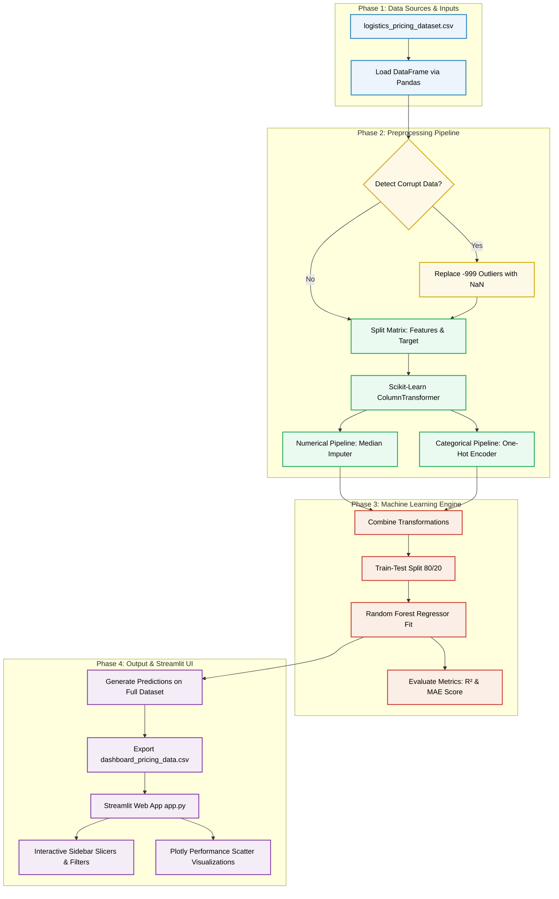

# 📊 **Logistics Pricing Optimization Model** 

##**Overview:** This machine learning model predicts freight shipping rates by identifying patterns across various shipping conditions. It helps logistics managers automate invoice validation and uncover hidden cost drivers.

##**🔎 Key Components**
- **Model Type:** Random Forest Regressor (an ensemble machine learning algorithm that combines multiple decision trees to prevent overfitting and ensure reliable price predictions).
- **Target Variable:** Actual_Price_USD (the final invoice cost of the shipment).

##**📈 Structural Cost Factors**
The model analyzes two main types of inputs to calculate a delivery price:
1. **Core Numerical MetricsDistance (Miles):** The physical length of the haul route.
   - **Weight (Lbs):** The physical size and load impact of the cargo.
   - **Lead Time (Days):** How far in advance the shipment was booked.
   - **Fuel Surcharge Rate:** Floating energy cost indexing adjustments.
   - **Urgency Flag:** Priority express shipping status.
2. **Categorical Operational Slicers**
   - **Origin / Destination:** Regional geographical shipping hubs.
   - **Transport Mode:** Fleet classification (Air Freight, Truckload, or Less-Than-Truckload).
   - **Carrier:** The specific shipping company handling the transit.
##💡 **Automated Data Pipeline Features**
- **Robust Cleaning:** The model automatically replaces corrupt spatial entries (like -999 mileage errors) and fills missing load parameters using localized statistical values.
- **One-Hot Encoding:** It instantly translates textual data (like city names or carrier names) into mathematical structures that the machine learning engine can understand.

# 🚚 Optimization Engine Work Flow

This flowchart outlines the complete end-to-end data pipeline, machine learning workflow, and interactive dashboard deployment architecture for the project. 

Copy and paste the markdown block below directly into your GitHub `README.md` file. GitHub will automatically render it as a visual diagram using its native **Mermaid** support.

